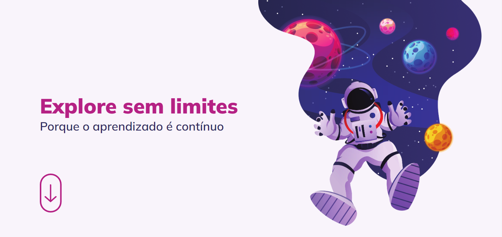

<h1 align="center"> Explore sem limites. </h1>

Porque o aprendizado é contínuo.

  <a href="#-tecnologias">Tecnologias</a>&nbsp;&nbsp;&nbsp;|&nbsp;&nbsp;&nbsp;
  <a href="#-projeto">Projeto</a>&nbsp;&nbsp;&nbsp;

 

## 📱 Mobile.

  

 

## 🖥️ DeskTop.

  

## 💻 Projeto

Landing Page criada no Explorer, motivando você ao desenvolvimento constante e lembrando que o progresso deve ser contínuo.  

## 🔖 Layout

Você pode visualizar o resultado clincando neste [LINK](https://kiqprado.github.io/Space/).

---

 
 
  
  &nbsp;&nbsp;&nbsp;|&nbsp;&nbsp;&nbsp;
  
 

